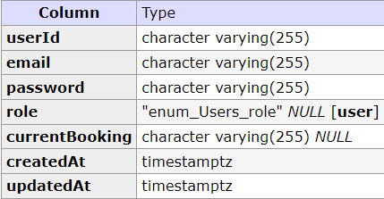
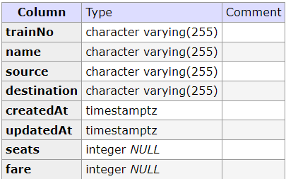
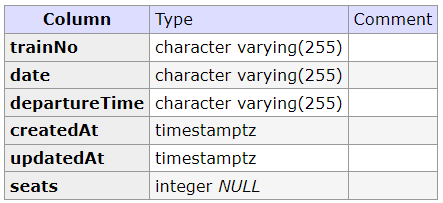
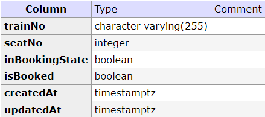
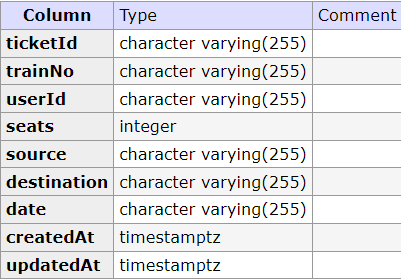

# Railway API
Anakin Assignment Submission by Sahil Khadayate (sahilkhadayatework@gmail.com)

## Setup
Follow these steps to set up this project:

1. **Clone the repository** to your local machine.
    ```sh
    git clone <repository_url>
    ```
2. **Navigate to the project directory**.
    ```sh
    cd <project_directory>
    ```
3. **Install the required dependencies**.
    ```sh
    npm install
    ```
4. **Set up your environment variables** in the `.env` file. You need to provide values for the `APIKey` and `PORT`.
   
5. **Start the PostgreSQL database** using Docker Compose.
    ```sh
    docker-compose up -d
    ```
This starts a local postgresql docker instance at localhost.
You can also view the database gui at `http://localhost:8080`
database used in this project is named test.

6. **Run the development server**.
    ```sh
    npm run dev
    ```

The server should now be running at `http://localhost:<PORT>` where `<PORT>` is the port number you specified in the `.env` file.

Please also add a `APIKey` and a `jwtSecret` to this `.env` file


Please note that you need to have Node.js, npm, Docker, and Docker Compose installed on your machine to set up and run this project.

## Testing 

Postman collection is also available in this repo which can be used to test the api.
`Please visit : https://www.postman.com/sahil314/workspace/anakin-api-tests/collection/19671509-24d5150e-ad2b-42bb-b0e2-89cd29a4008b?action=share&creator=19671509`
to go to the postman collection where I have done the testing.





